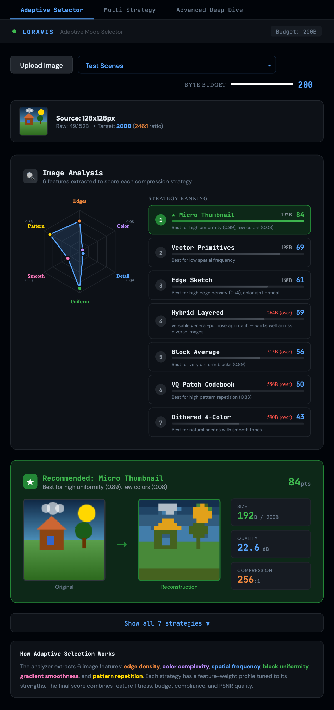
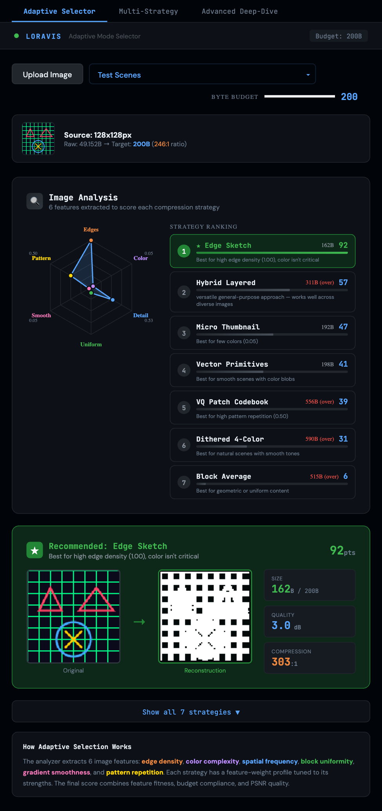
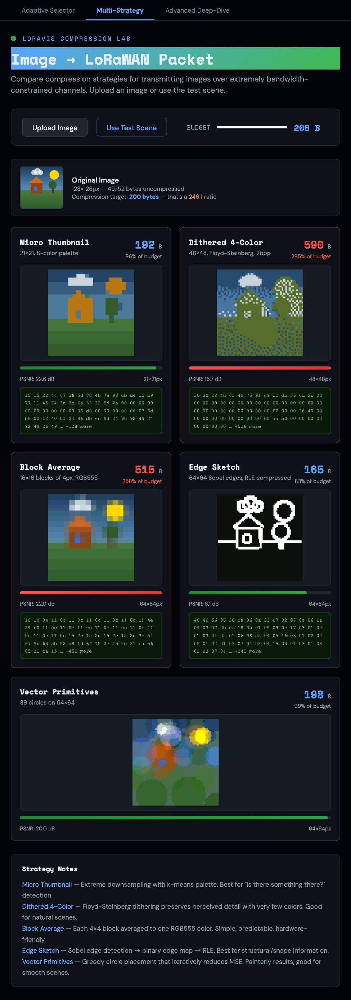
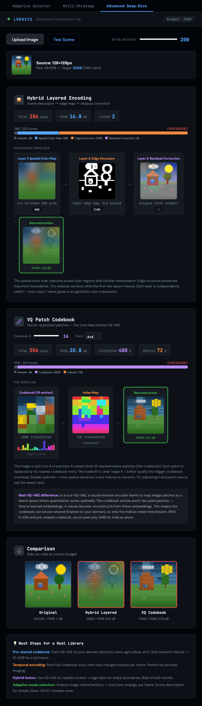

# LoRaVis

**Interactive image compression explorer for LoRaWAN** — compress a 128×128 image down to 50–250 bytes and transmit it over a low-power IoT network.

LoRaWAN limits payloads to ~250 bytes at the lowest data rates, a 500:1 to 5000:1 compression ratio. This project explores what visual information survives at those extremes, and which compression strategy best fits a given image's content.

---

## Prototypes

Three interactive tools, each building on the last:

### 1. Adaptive Mode Selector
Analyzes an image across 6 perceptual features — edge density, color complexity, spatial frequency, block uniformity, gradient smoothness, and pattern repetition — and automatically recommends the best strategy for your byte budget.



The radar chart shows the feature profile of the input image. The ranked list scores all 7 strategies against that profile, highlighting which ones fit the budget (green) and which exceed it (red).

Different images get different recommendations:



Edge-heavy content (grids, diagrams, technical drawings) shifts the recommendation to **Edge Sketch**, which uses Sobel edge detection + RLE encoding instead of color data.

---

### 2. Multi-Strategy Comparison
Side-by-side view of all 5 classical strategies applied to the same image. Shows each strategy's encoded byte array, PSNR quality score, and pixel reconstruction.



---

### 3. Advanced Deep-Dive
Pipeline visualization for the two most complex strategies: **Hybrid Layered** (spatial color map + edge structure + residual correction) and **VQ Patch Codebook** (vector quantization with a learned per-image codebook).



---

## Compression Strategies

| Strategy | Typical Size | Approach |
|---|---|---|
| **Micro Thumbnail** | ~192 B | Bilinear downsample + k-means palette |
| **Dithered 4-Color** | ~590 B | Floyd-Steinberg dithering, 2-bit pixels |
| **Block Average** | ~515 B | 4×4 block color averaging |
| **Edge Sketch** | ~162 B | Sobel edges → binary map + RLE |
| **Vector Primitives** | ~198 B | Greedy circle/rect placement |
| **Hybrid Layered** | ~264 B | Spatial color + edge + residual layers |
| **VQ Patch Codebook** | ~556 B | 4×4 patch vector quantization |

---

## How the Adaptive Selector Works

```
Image → Feature Extractor → Score × 7 strategies → Rank → Recommend
```

Six normalized features (0–1) are extracted from the source canvas using Sobel operators, k-means color counting, DCT-like frequency analysis, and block variance. Each strategy has a hand-tuned weight profile against those features. The final score combines:

- **Feature fitness** — dot product of image features × strategy weights
- **Budget compliance** — +10 bonus if within budget, +5 efficiency bonus proportional to how close
- **PSNR quality** — bonus for strategies achieving >20 dB after reconstruction

Budget heavily influences the outcome: at 200 B most strategies exceed the limit, so compact encodings like Edge Sketch and Micro Thumbnail dominate. At 500 B, Hybrid Layered's general-purpose profile takes over.

---

## Running Locally

```bash
npm install
npm run dev        # starts on http://localhost:5175
```

Requires Node 18+. No backend — all compression runs in-browser on the Canvas API.

---

## Roadmap

From [`HANDOFF.md`](HANDOFF.md):

- [ ] **Python library** — `loravis.encode(img, budget)` / `loravis.decode(packet)` for actual LoRa transmission
- [ ] **Pre-shared codebook** — fixed VQ codebook baked into firmware, eliminating per-packet codebook overhead
- [ ] **Temporal diff mode** — delta encoding between frames for video/timelapse sensors
- [ ] **Adaptive mode selection** ✅ — this prototype

---

## Stack

React 19 · Vite · Canvas API · SVG · No dependencies beyond React
